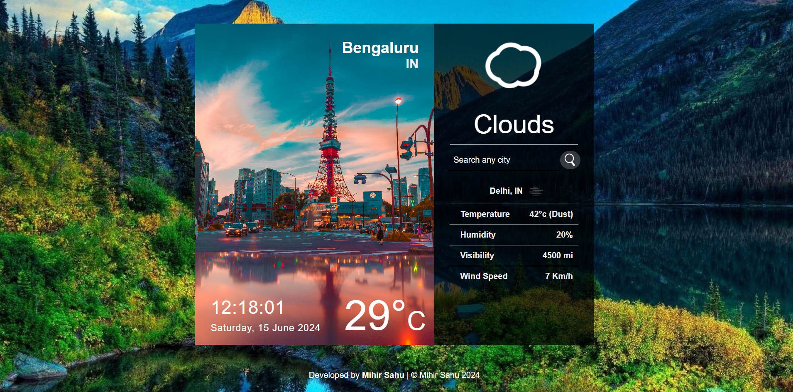

# Live Weather App using React.js



## Overview
This project is a Live Weather App developed using React.js. It displays the current location's time, day, date, month, year, and temperature. Users can also search for a specific city to retrieve detailed weather information, including temperature, humidity, visibility, wind speed, and a forecast icon indicating the weather condition. The app utilizes the OpenWeather API to fetch genuine weather data.

## Features
- Displays current location's time, day, date, month, year, and temperature.
- Search functionality to find weather details of any city.
- Shows temperature, humidity, visibility, wind speed, and weather forecast icon.
- Uses OpenWeather API for reliable weather data.

## Getting Started
### Prerequisites
Ensure you have Node.js and npm (Node Package Manager) installed on your machine.

### Installation
1. **Clone the repository:**


2. **Install dependencies:**


3. **Change the API key**
- Add your OpenWeather API key in apiKeys.js:
  ```
  key:"your_openweather_api_key_here"
  ```

### Running the App

  ```
  npm install
  ```

  ```
  npm start
  ```

Open [http://localhost:3000](http://localhost:3000) to view it in the browser.

## Technologies Used
- React.js
- HTML
- CSS
- JavaScript

## API Reference
This app fetches weather data using the [OpenWeather API](https://openweathermap.org/api).

## Project Structure
- **`src/currentLocation.js`**: Details about the time and weather of current location.
- **`src/forcast.js`**: It is used for searching weather condition of any city.
- **`src/App.js`**: Main component that renders other components.
- **`src/App.css`**: Styles for the app.

## Contact
If you have any questions or feedback, feel free to reach out at [mihirsahu36@gmail.com](mailto:mihirsahu36@gmail.com).

---

Enjoy using the Live Weather App!
